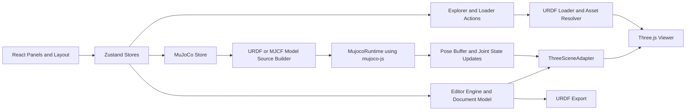
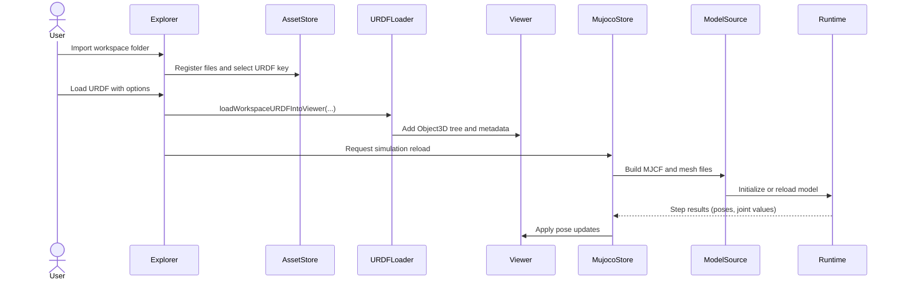

# React + TypeScript + Vite

This template provides a minimal setup to get React working in Vite with HMR and some ESLint rules.

Currently, two official plugins are available:

- [@vitejs/plugin-react](https://github.com/vitejs/vite-plugin-react/blob/main/packages/plugin-react) uses [Babel](https://babeljs.io/) (or [oxc](https://oxc.rs) when used in [rolldown-vite](https://vite.dev/guide/rolldown)) for Fast Refresh
- [@vitejs/plugin-react-swc](https://github.com/vitejs/vite-plugin-react/blob/main/packages/plugin-react-swc) uses [SWC](https://swc.rs/) for Fast Refresh

## React Compiler

The React Compiler is not enabled on this template because of its impact on dev & build performances. To add it, see [this documentation](https://react.dev/learn/react-compiler/installation).

## Expanding the ESLint configuration

If you are developing a production application, we recommend updating the configuration to enable type-aware lint rules:

```js
export default defineConfig([
  globalIgnores(['dist']),
  {
    files: ['**/*.{ts,tsx}'],
    extends: [
      // Other configs...

      // Remove tseslint.configs.recommended and replace with this
      tseslint.configs.recommendedTypeChecked,
      // Alternatively, use this for stricter rules
      tseslint.configs.strictTypeChecked,
      // Optionally, add this for stylistic rules
      tseslint.configs.stylisticTypeChecked,

      // Other configs...
    ],
    languageOptions: {
      parserOptions: {
        project: ['./tsconfig.node.json', './tsconfig.app.json'],
        tsconfigRootDir: import.meta.dirname,
      },
      // other options...
    },
  },
])
```

You can also install [eslint-plugin-react-x](https://github.com/Rel1cx/eslint-react/tree/main/packages/plugins/eslint-plugin-react-x) and [eslint-plugin-react-dom](https://github.com/Rel1cx/eslint-react/tree/main/packages/plugins/eslint-plugin-react-dom) for React-specific lint rules:

```js
// eslint.config.js
import reactX from 'eslint-plugin-react-x'
import reactDom from 'eslint-plugin-react-dom'

export default defineConfig([
  globalIgnores(['dist']),
  {
    files: ['**/*.{ts,tsx}'],
    extends: [
      // Other configs...
      // Enable lint rules for React
      reactX.configs['recommended-typescript'],
      // Enable lint rules for React DOM
      reactDom.configs.recommended,
    ],
    languageOptions: {
      parserOptions: {
        project: ['./tsconfig.node.json', './tsconfig.app.json'],
        tsconfigRootDir: import.meta.dirname,
      },
      // other options...
    },
  },
])
```


Web-based robotics scene inspector and editor for importing, visualizing, and simulating URDF/MJCF models in the browser.

The project combines:
- React + Vite for the UI.
- Three.js for rendering and interaction.
- MuJoCo (WASM via `mujoco-js`) for simulation runtime.
- Zustand stores for app/editor/simulation state orchestration.

## Current Status
- Project maturity: experimental (active development).
- Main focus: URDF-first authoring/import, browser simulation, and debugging workflows.

## Implemented Features

### Workspace and import
- Import an entire workspace folder (`.urdf` + meshes) from the Explorer panel.
- Select and load a URDF from imported files.
- URDF load options:
- `urdfZUp` (ROS Z-up -> editor Y-up mapping).
- `floatingBase` (free root joint behavior).
- `firstLinkIsWorldReferenceFrame` (ignore world-reference root link).
- `selfCollision` toggle.
- Collision mode selection (`mesh` or `fast`).
- Robust asset resolution for common URDF path styles (`package://`, relative paths, basename fallback).

### Scene authoring and editing
- Scene hierarchy with robotics node types (`robot`, `link`, `joint`, `visual`, `collision`, `mesh`).
- Asset library for quick insertion of robotics primitives and basic meshes.
- Transform gizmo with move/rotate/scale.
- Keyboard edit actions:
- Copy, paste, duplicate, delete.
- Undo/redo.
- Menu actions for file/edit workflows.

### Viewport and debug tooling
- Runtime viewport controls (`Play`, `Pause`, `Reload`).
- URDF debug overlays/toggles:
- Visuals.
- Collisions.
- Inertias.
- Center of mass (COM).
- Link axes and joint axes.
- Pointer spring interaction during simulation (`Alt + drag`).

### Simulation pipeline
- URDF -> MJCF conversion pipeline for MuJoCo execution.
- Mesh handling for MuJoCo compatibility (including `.dae` conversion path to `.stl` when needed).
- Optional fast collision proxy generation for performance-oriented simulation.
- Runtime reload on scene changes via store-driven simulation orchestration.


## Architecture

### High-level component architecture



### URDF-to-simulation flow




## Quick Start (Development)

Requirements:
- Node.js 22+ (recommended for `corepack` workflow).
- `pnpm`.
- Chromium-based browser recommended (`webkitdirectory` is used for folder import).

Run locally:

```bash
cd robot-editor-web
corepack enable
pnpm install
pnpm dev
```

Build and preview:

```bash
cd robot-editor-web
pnpm build
pnpm preview
```

## Typical Workflow
1. Open `Explorer` and click `Import workspace`.
2. Select a folder containing a `.urdf` and its mesh resources.
3. Select the desired URDF in the tree.
4. Click `Load URDF` and confirm import options.
5. Use `Viewport` for edit/simulate/debug.

## Keyboard Shortcuts
- `W` move gizmo mode.
- `E` rotate gizmo mode.
- `R` scale gizmo mode.
- `Shift` snap (grid and rotation).
- `Q` jump to parent robot reference (from link context).
- `Alt + left-drag` pointer spring interaction during simulation.
- `Ctrl/Cmd + C` copy.
- `Ctrl/Cmd + V` paste.
- `Ctrl/Cmd + D` duplicate.
- `Delete` or `Backspace` delete selection.
- `Ctrl/Cmd + Z` undo.
- `Ctrl/Cmd + Shift + Z` redo.

## Configuration (`VITE_` env vars)

You can override defaults in `robot-editor-web/.env.local`.

Common variables:
- `VITE_TRAINING_API_BASE_URL`: optional backend endpoint for training jobs (fallback to local simulated runtime if empty).
- `VITE_TRAINING_API_TOKEN`: optional bearer token for protected `training-api` endpoints.
- `VITE_TRAINING_INITIAL_TOKENS`: local token balance shown in top bar (default: `20`).
- `VITE_TRAINING_JOB_TOKEN_COST`: token cost per training launch (default: `1`).
- `VITE_XACRO_ENDPOINT`: optional endpoint to expand xacro before simulation.
- `VITE_URDF_MESH_MODE`: collision mode override (`mesh|box|sphere|cylinder|fast`).
- `VITE_URDF_DEFAULT_DAMPING`: default joint damping.
- `VITE_URDF_DEFAULT_FRICTION`: default joint friction.
- `VITE_URDF_DEFAULT_ARMATURE`: default joint armature.
- `VITE_MUJOCO_DEBUG`: enable MuJoCo conversion/runtime debug logs.

## Runtime Training Panels

When `VITE_TRAINING_API_BASE_URL` is set, runtime plugins use the remote control plane:

- Training panel:
  - launch/cancel jobs
  - live status/progress
  - job inspector with artifacts (`/v1/artifacts`) and events (`/v1/debug/jobs/{jobId}/events`)
- Recordings panel:
  - completed runs and derived quality metrics
  - `Resolve video` / `Open video` using artifact kind `video`

Example `.env.local`:

```bash
VITE_TRAINING_API_BASE_URL=http://localhost:8082
VITE_TRAINING_API_TOKEN=<token>
VITE_TRAINING_INITIAL_TOKENS=20
VITE_TRAINING_JOB_TOKEN_COST=1
```

## Deployment
- Full deployment guide: `deploy/README.md`.
- Default serving path in current proxy config: `http://<VPS_PUBLIC_IP>/mierdisim`.

## Roadmap (Translated from Original TODO)
This section mirrors the original backlog notes and may lag behind current implementation details.

### Done
- [x] Implement console as runtime debugging console.
- [x] Keep tree status when switching between Scene and Assets/Joint panels.
- [x] Copy, paste, and delete objects in scene.
- [x] Fix import bug when model has no visuals.
- [x] Refactor MJCF loader and scene integration.
- [x] Add 3-axis rotation selector with axis color coding.
- [x] Add XYZ axis color coding in assets.
- [x] Resolved viewport bug when editing positions with actuators.

### In progress
- [ ] URDF creator/editor (mesh combination, joint creation).
- [ ] Move links with gizmo and improve local-mode behavior.
- [X] Rename behavior on duplicate for clearer naming.

### Planned
- [ ] Add editor top menu UI.
- [ ] Activate/deactivate Robot or links, button to go directly to properties and button to add new object (link or joint)
- [ ] Replace native right-click menu with custom menu.
- [ ] Add new-link creation inside imported URDF models.
- [ ] Add and remove properties to existing assets from inspector.
- [ ] Support link reference-frame changes.
- [X] Mark joints as motorized/non-motorized.
- [ ] Adjust debug arrow sizes.
- [ ] Implement floating actuator joint.
- [ ] Better simulation top bar (stats, FPS, running state).
- [ ] USD support.
- [/] Reorganize simulation controls dropdown.
- [ ] Improve missing-mesh diagnostics and URDF debugging.
- [ ] Editor component improvements.
- [/] Export full environment or robot.
- [ ] Tutorial documentation.
- [ ] Populate built-in asset library.
- [/] Improve UI styling, colors, and theme system.
- [ ] Cameras.
- [ ] Actuators.
- [ ] Sensors.
- [ ] Lights.

## Legacy Setup Notes

```text
pnpm create vite robot-editor-web --template react-ts
cd robot-editor-web/
pnpm install
pnpm dev
pnpm add three @types/three zustand
pnpm add react-resizable-panels
pnpm add three-stdlib
pnpm add three-stdlib
pnpm add urdf-loader
```
